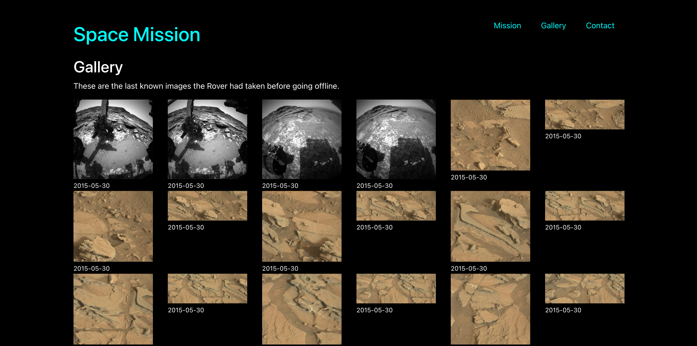

# Routing and API Exercise



## Exercise overview

In this exercise we will be a space mission website that will inform astronauts the details of their next mission. The site will also access NASA API to get images from the Mars rover. If you would like to learn more about the API we are using you can visit the website at: [https://api.nasa.gov/](https://api.nasa.gov/).

## Set Up A New React Project

- Open the terminal to the `exercise` directory--the simplest way to do so is to right-click on the `exercise` folder in VS Code and select "Open in Integrated Terminal".

- In the terminal, type `npm create vite .` and hit enter/return. The `.` is important--this will create a new Vite project in the current directory.

- It will warn you that there are files here currently. Use the arrow keys and Enter/Return to select "Ignore files and continue". This allows us to keep our readme and any data/assets files we have in our new project folder.

- Choose React and then JavaScript from the following menus, using arrow keys and Enter/Return.

- Install dependencies by entering `npm install` in the terminal.

## Install React Router DOM

- Install React Router. In your terminal, type `npm i react-router-dom@6.29.0`. This will install the package into our project.

- Handle a Vite/React-Router conflict by running `npm dedupe`. This will remove the conflicting package and allow React Router to work properly.

## Install Bootstrap

- Next let's import Bootstrap, a front-end framework that provides CSS code to make our project beautiful. In terminal type `npm i bootstrap@5.2.3`. This will install the package into our project.

- Run the app by typing `npm run dev` in the terminal. This will provide a clickable link to open the app in your default browser, or you can navigate to the localhost URL in your browser.

## Import Bootstrap

7. Then in VS Code, open the **/src/main.jsx** file and import the bootstrap css like by typing the following line `import 'bootstrap/dist/css/bootstrap.css';` placing it just after the import for ReactDOM and just before our import for **Index.css**.

## Import And Use BrowserRouter

8. On **main.jsx** import the Browser Router by typing the following line `import { BrowserRouter } from 'react-router-dom';` placing it just after the import for **App.jsx**. Then, wrap the App component in `<BrowserRouter></BrowserRouter>` tags.

## Exercise Assets

9. Move the image files from the _/assets_ folder outside the project folder into the folder _/public/_ this way the images will be accessible to your application. Also move the components folder and hooks folders into the `src` folder.

## Creating the App Component

10. Open **/src/App.jsx**. This file is an example component that React starts with. You can delete everything in this file. Create the boiler plate code for a functional component called `App`. Don't forget to export it.

## Adding Custom CSS

11. At the top of file after the React import add `import './App.css';`.

12. Open **/src/App.css** and delete all the code there and replace with the following CSS:

```css
body {
  margin: 30px;
  color: white;
  background: black;
}

nav {
  text-align: right;
}

a {
  display: inline-block;
  color: aqua;
}

a:hover {
  color: yellow;
  text-decoration: underline;
}

nav a {
  padding: 10px 20px;
}

h1,
h2,
h3 {
  margin-top: 15px;
}

th,
td {
  color: white;
}
```

13. Back in **/src/App.jsx**, at the top of the file below the React import we want to import the Router, and Route.

```javascript
import { Routes, Route } from "react-router-dom";
```

14. In the `return()` statement return the following JSX code:

```jsx
<div className="container">
  <div className="row">
    {/* Header goes here... */}
    {/* Navbar goes here... */}
  </div>
  <div className="row">
    {/* Routes go here */}
  </div>
</div>
```
You can add routes for the following paths: the default path, `mission`, `gallery`, and `contact`.  Feel free to have them point to placeholder `h1` elements for now.  Use your browser to navigate to the different routes to confirm they work.

## Create Header Component

Most of these other components will display static data so we will create them as static functional components.

15. From the File Explorer from the left side panel **right click** on the **/src/** folder and select **New File**. Name the file `Header.jsx`.

16. Open the **/src/Header.jsx** file and create the basic functional component scaffolding. Name the function `Header`.

17.  In the Header component, add an element that will link back to the home page.  Be sure to use the `Link` component from  **react-router-dom**

19. Save this file and head back to **/src/App.jsx** to import it.

20. Then replace the comment `{/* Header will go here */}` with our static `Header` component.

## Create Navbar Component

21. From the File Explorer from the left side panel **right click** on the **/src/** folder and select **New File**. Name the file `Navbar.jsx`.

22. Open the **/src/Navbar.jsx** file and create the basic functional component scaffolding. Name the function `Navbar`.

23. The `Navbar` component should consist of a navbar with links to the remaining Routes specified in App.jsx.

25. Save this file and head back to **/src/App.jsx** and import it.

27. Then replace the comment `{/* Navbar will go here */}` with our `<Navbar />` component.

## Create Home Component

27. From the File Explorer from the left side panel **right click** on the **/src/** folder and select **New File**. Name the file `Home.jsx`.

28. Open the **/src/Home.jsx** file and create the basic functional component scaffolding. Name the function `Home`.

29. Fill the empty `return ( )` with the following elements:

```jsx
<div className="col-12">
  <h2>Welcome Astronauts</h2>
  
  <h3>About</h3>
  <p>
    You will use this site to brief yourself on upcoming space missions. For
    more information visit the official{" "}
    <a href="https://mars.nasa.gov/mars2020/" target="_blank" rel="noreferrer">
      Mars Perseverance Mission Site
    </a>
  </p>
  <p>
    We’ve been driving on Mars since 1997, beginning with the 83 sol Sojourner
    rover mission. Since 2003 with the arrival of the Spirit and Opportunity
    rovers, followed by the Curiosity rover in 2012 and Perseverance rover in
    2021 we have been continuously exploring the surface of Mars. The
    Perseverance mobility system was designed to enable faster and more precise
    autonomous driving than any prior mission. It has wheels optimized for
    rugged terrain, cameras with fast exposure times, wide navigation camera
    “Navcam” field of view, and a dedicated second computer and Field Gate
    Programmable Array “FPGA” for fast image processing. Visual Odometry, “VO”,
    tracks the motion of features in images as it is driving to provide accurate
    position estimates and measure slip. “Thinking-While-Driving” capability
    allows Perseverance to continuously drive while performing VO, generating a
    map of terrain geometry, and autonomously blending drive arcs and selecting
    a safe and efficient drive path.
  </p>
</div>
```
30. Save this file and head back to **/src/App.jsx** and import it

31. Then add `element={<Home />}` to the `<Route path="/" />` component.

## Create Mission Component

32. From the File Explorer from the left side panel **right click** on the **/src/** folder and select **New File**. Name the file `Mission.jsx`.

33. Open the **/src/Mission.jsx** file and create the basic functional component scaffolding. Name the function `Mission`.

34. Fill the empty `return ( )` with the following elements:

```jsx
<div className="col-12">
  <h2>Mission</h2>
  
  <h3>Key Details</h3>
  <p>
    Mission Name: Mars 2020
    <br />
    Rover Name: Perseverance
    <br />
    Main Job: Seek signs of ancient life and collect samples of rock and
    regolith (broken rock and soil) for possible return to Earth.
    <br />
    Launch: July 30, 2020
    <br />
    Landing: Feb. 18, 2021, Jezero Crater, Mars
    <br />
    Tech Demo: The Mars Helicopter completed its 30-day technology demonstration
    and is now in its new operations demo phase.
  </p>
  <h3>Issue</h3>
  <p>
    The Mars Rover's cameras went dark after a bright pulsing light was detected
    and now the cameras are no longer operating.
  </p>
  <h3>Mission Overview</h3>
  <p>
    Astronaut, your mission is as follows. You will be landing on Mars where you
    will locate the rover and download the images being stored on it's drive,
    you will be accompanied by Dr. Skeleton who will attempt to repair the
    cameras. You will protect and assist Dr. Skelton until he completes repairs
    and then return to the module 9 station for debriefing and to report your
    findings.
  </p>
</div>
```

The finished Mission code should look like this:

```jsx
function Mission() {
  return (
    <div className="col-12">
      <h2>Mission</h2>
      
      <h3>Key Details</h3>
      <p>
        Mission Name: Mars 2020
        <br />
        Rover Name: Perseverance
        <br />
        Main Job: Seek signs of ancient life and collect samples of rock and
        regolith (broken rock and soil) for possible return to Earth.
        <br />
        Launch: July 30, 2020
        <br />
        Landing: Feb. 18, 2021, Jezero Crater, Mars
        <br />
        Tech Demo: The Mars Helicopter completed its 30-day technology
        demonstration and is now in its new operations demo phase.
      </p>
      <h3>Issue</h3>
      <p>
        The Mars Rover's cameras went dark after a bright pulsing light was
        detected and now the cameras are no longer operating.
      </p>
      <h3>Mission Overview</h3>
      <p>
        Astronaut, your mission is as follows. You will be landing on Mars where
        you will locate the rover and download the images being stored on it's
        drive, you will be accompanied by Dr. Skeleton who will attempt to
        repair the cameras. You will protect and assist Dr. Skelton until he
        completes repairs and then return to the module 9 station for debriefing
        and to report your findings.
      </p>
    </div>
  );
}

export default Mission;
```

35. Save this file and head back to **/src/App.jsx** and after the React Router DOM import, include an import to the `Mission` component.

```javascript
import Mission from "./Mission";
```

36. Then add `element={<Mission />}` to the `<Route path="/mission" />` component.

## Create Contact Component

37. From the File Explorer from the left side panel **right click** on the **/src/** folder and select **New File**. Name the file `Contact.jsx`.

38. Open the **/src/Contact.jsx** file and create the basic functional component scaffolding. Name the function `Contact`.

39. Fill the empty `return ( )` with the following elements:

```jsx
<div className="col-12">
  <h2>Contact</h2>
  
  <table className="table">
    <tbody>
      <tr>
        <th>Dr. Bennet Radlow</th>
        <td>Mars Mission Dept Head</td>
        <td>555-358-8346</td>
        <td>b.radlow@nasa.gov</td>
      </tr>
      <tr>
        <th>Dr. Janet Pickelow</th>
        <td>Astro Physicist</td>
        <td>555-276-9947</td>
        <td>j.pickelow@nasa.gov</td>
      </tr>
      <tr>
        <th>Dr. Susan Kent</th>
        <td>Head Robotics Engineer</td>
        <td>555-354-1285</td>
        <td>s.kent@nasa.gov</td>
      </tr>
      <tr>
        <th>Dr. Seth Skeleton</th>
        <td>Rover Engineer</td>
        <td>555-456-3467</td>
        <td>s.kent@nasa.gov</td>
      </tr>
    </tbody>
  </table>
</div>
```

The finished Contact code should look like this:

```jsx
function Contact() {
  return (
    <div className="col-12">
      <h2>Contact</h2>
      
      <table className="table">
        <tbody>
          <tr>
            <th>Dr. Bennet Radlow</th>
            <td>Mars Mission Dept Head</td>
            <td>555-358-8346</td>
            <td>b.radlow@nasa.gov</td>
          </tr>
          <tr>
            <th>Dr. Janet Pickelow</th>
            <td>Astro Physicist</td>
            <td>555-276-9947</td>
            <td>j.pickelow@nasa.gov</td>
          </tr>
          <tr>
            <th>Dr. Susan Kent</th>
            <td>Head Robotics Engineer</td>
            <td>555-354-1285</td>
            <td>s.kent@nasa.gov</td>
          </tr>
          <tr>
            <th>Dr. Seth Skeleton</th>
            <td>Rover Engineer</td>
            <td>555-456-3467</td>
            <td>s.kent@nasa.gov</td>
          </tr>
        </tbody>
      </table>
    </div>
  );
}

export default Contact;
```

40. Save this file and head back to **/src/App.jsx** and after the React Router DOM import, include an import to the `Contact` component.

```javascript
import Contact from "./Contact";
```

41. Then add `element={<Contact />}` to the `<Route path="/contact" />` component.

## Gallery and Photo Component

This will be a special component that will pull down images from the NASA API.

Your Gallery component should make an API call to the following URL (API key included!) `https://api.nasa.gov/mars-photos/api/v1/rovers/curiosity/photos?sol=1000&api_key=Lc6mCmy8pmn55pfWyTeOUCytfdZvsJsUqRhtowWL`

After getting the photo data from the NASA API, display the image and the earth date (if there is no data, make sure to not display anything).  Observe the data you are receiving in order to figure out how to accomplish this.

55. Save all files and check your work in the browser. Each link should display the corresponding component for that page. the Gallery page should display the images form the NASA API.
